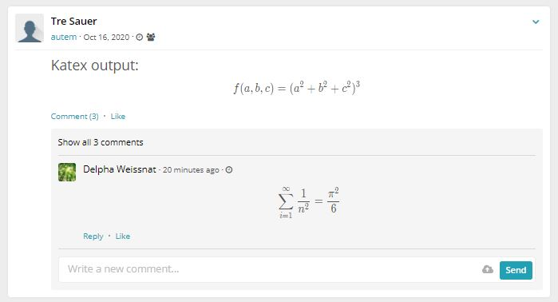

### KaTeX for HumHub (beta)

Once installed this plugin adds [KaTeX](https://katex.org/) support to the HumHub richtext output.

**This module requires HumHub v1.7+**



### Build

In order to build the js bundle `resources/js/humhub.katex.bundle` you need to:

- Install npm:

```
npm install
```

- Run rollup build:

```
npm run build
```